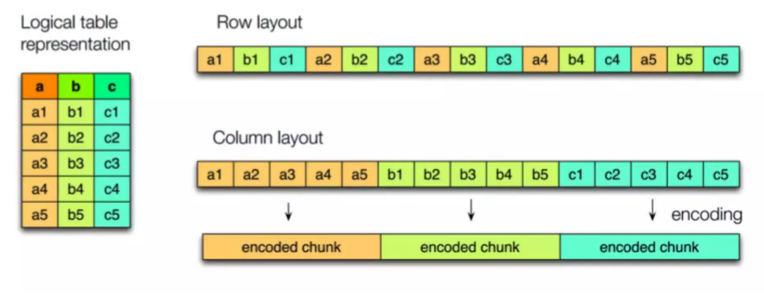

# Formato Apache Parquet

<div style="text-align: center;">
  
</div>

#### Membros
- Antonio Henrique Machado
- Isadora Mota de Souza
- Ingridy Guerra

Parquet é um formato de armazenamento colunar usado para armazenar grandes volumes de dados de forma eficiente.

É uma escolha popular para armazenar dados no ecossistema Hadoop (em ambiente distribuído), permitindo consultas e análises eficientes com ferramentas como Apache Spark e Pandas.

- Arquivo binário
- Guarda a estrutura dos dados (metadados)
- Eficiência em espaço
- Eficiência na recuperação de informações

> [!NOTE]
> Vale ressaltar que o Parquet não é a única opção para armazenamento eficiente de dados. Outras alternativas incluem Avro e ORC.

### configurando projeto

criando ambiente virtual

```sh
python -m venv venv
```

selecione ele como interpretador na sua IDE.

Ativando o ambiente:

- Windows

```sh
.\venv\Scripts\activate
```

- Linux

```sh
source env/bin/activate
```

Atualize o pip:

```sh
pip install --upgrade pip
```

Instale as dependencias:

```sh
pip install -r requirements.txt
```

Verifique a instalação:

```sh
pip list
```

### Alguns casos de uso específicos para arquivos `.parquet`
- Armazenamento de grandes volumes de dados estruturados ou semiestruturados.
- Consulta de dados usando ferramentas semelhantes a SQL.
- Compartilhamento de dados entre sistemas.

### Principais características de arquivos no formato Parquet:
- Ótima compressão dos dados (excelente para armazenamento).
- Leitura seletiva (leitura somente dos dados necessários).
- Suporte em diversas plataformas (Spark, Pandas, etc.).
- Facilidade de particionamento (excelente para leitura de dados).

### Como o Parquet funciona?
> [!NOTE]
> O principal objetivo do Parquet é armazenar dados no menor tamanho possível, proporcionando consultas eficientes!

Isso é possível graças ao seu formato colunar:

<div style="text-align: center;">
  
</div>

Em um arquivo orientado a colunas, as informações sobre cada campo são armazenadas em colunas separadas. Todos os valores de uma coluna são salvos juntos, independentemente dos registros, permitindo a leitura somente das colunas necessárias para a consulta.

### Como o armazenamento é otimizado?

Através de algoritmos de compressão, como o dict coding:

<div style="text-align: center;">
  
</div>

e o RLE (Run-Length Encoding):

<div style="text-align: center;">
  
</div>

### Performance

<div style="text-align: center;">
  
</div>

Embora o Parquet seja colunar, ele também é dividido em grupos de linhas. A cada _n_ linhas de dados, é criado um grupo, e os dados são organizados em colunas, aplicando-se compressão.

Para cada grupo, são persistidas as estatísticas desse grupo em uma camada acima dos dados.

<div style="text-align: center;">
  
</div>

Como temos os resumos dos dados de cada grupo, ao realizar consultas filtradas, é possível pular os blocos que não contêm as informações desejadas. Dessa forma, somente os dados necessários são descompactados e retornados. Mesmo com a compressão aplicada, o Parquet evita o processamento de informações irrelevantes.

<div style="display: flex; justify-content: center; gap: 20px;">
  
  
</div>

### Hands-on

#### Resumão

Diferente do CSV que é orientado a linha o parquet é orientado a coluna.

> [!NOTE]
> Que DIABOS é um formato orientado a linhas?


```csv
id, linguagem_programacao, criador, ano_criacao, quem_mantem
1,Python,Guido van Rossum,1991,Python Software Foundation
2,Java,James Gosling,1995,Oracle
3,JavaScript,Brendan Eich,1995,Ecma International
4,C,Denis Ritchie,1972,ISO
5,Ruby,Yukihiro Matsumoto,1995,Open Source Community
6,Go,Robert Griesemer e Rob Pike e Ken Thompson,2009,Google
7,Swift,Chris Lattner,2014,Apple
```

Vemos no exemplo `.csv` acima, que os dados são em registros/linhas!

##### Parquet

Aqui, mostrando a lógica orientada a colunas, os valores são armazenados, mantendo a identificação de onde ele veio

Dessa forma os valores de cada coluna é armazenado:

```
Python:1, Java:2, JavaScript:3, C:4, Ruby:5, Go:6, Swift:7 ...
```

Dessa forma, se quisermos a linguagem mais nova, é melhor orientado a linha ou coluna?

Se estivesse Orientado a linha, precisariamos ler tudo para ter a média. Mas, na análise colunar:

```
1991:1, 1995:2, 1995:3, 1972:4 ...
```

**MUITO FODA, NÉ??**

#### Tutorial

Ótimo, agora você já sabe o que é um arquivo `.parquet`, falar suas vantagens e mostrar como ele pode ser compactado.

Vamos agora ler, converter e gravar arquivos parquet?

Dados: [pasta data](https://drive.google.com/drive/folders/1gb7DQk0Bl8u3h2N_8W_ypewnWxNyk-Br?usp=sharing)
Video: [Video - Tutorial](https://www.canva.com/design/DAGOVTT2ZvA/MaBKEG5Ldxkpj7x3ab0_bQ/edit?classId=a332674b-b06a-4ae4-bef1-9a631babebc9&assignmentId=80145c5d-3114-4862-bc5e-71df47bb7a9c&submissionId=0aa9b499-b945-1882-1c1f-4398dc880be9)

## Conclusões

Em geral, o Parquet é uma escolha excelente para armazenamento e processamento de grandes volumes de dados, oferecendo eficiência em compressão e desempenho. A facilidade de uso depende da familiaridade com o ecossistema de ferramentas de big data e com as práticas recomendadas para configuração. Para a maioria dos casos de uso, o Parquet prova ser uma solução robusta e eficaz, embora usuários iniciantes possam encontrar algum desafio inicial na sua adoção.

O Apache Parquet possui uma comunidade ativa e uma documentação abrangente, ambos fundamentais para seu sucesso e adoção. A comunidade oferece suporte e recursos adicionais, enquanto a documentação oficial e das ferramentas fornece uma base sólida para entender e utilizar o Parquet de forma eficaz. Para desenvolvedores e analistas de dados, esses recursos são valiosos para resolver problemas, aprender novas técnicas e aproveitar ao máximo o potencial do formato Parquet.

## Referências

- [Formato Parquet - YouTube](https://www.youtube.com/watch?v=juMneHB5d2s)
- [Apache Parquet em 3 minutos. O que é? Como Funciona? - YouTube](https://www.youtube.com/watch?v=XWs60xKJOBk)
- [Efficient Data Storage for Analytics with Apache Parquet 2.0 - SlideShare](https://pt.slideshare.net/slideshow/hadoop-summit-36479635/36479635)
- [Lightweight Compression in DuckDB - DuckDB Blog](https://duckdb.org/2022/10/28/lightweight-compression.html)
- [Spark + Parquet In Depth: Spark Summit East Talk by Emily Curtin and Robbie Strickland - SlideShare](https://pt.slideshare.net/slideshow/spark-parquet-in-depth-spark-summit-east-talk-by-emily-curtin-and-robbie-strickland/72203147)
- [Predicate Pushdown e Projeção - ResearchGate](https://www.researchgate.net/figure/Use-predicate-pushdown-and-projection-pushdown-to-skip-reading-unnecessary-row-groups-or_fig2_340332233)
- [Documentação oficial do Parquet](https://parquet.apache.org/)
- [Tutorial Apache Parquet](https://www.youtube.com/watch?v=BztuEQ9ojtc&t=1499s)
